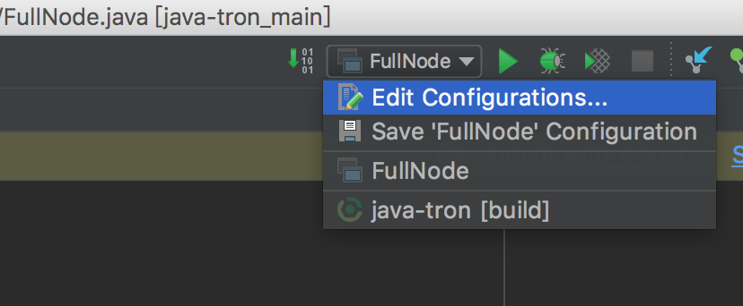
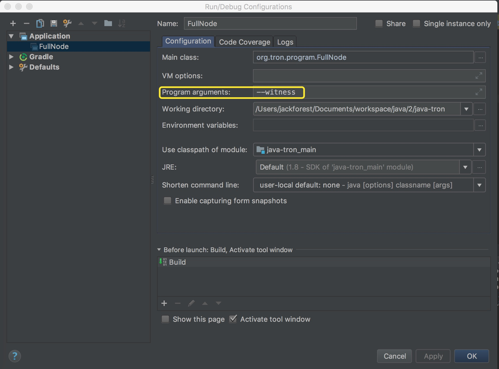

<h1 align="center">
  <br>
  
  <br>
  java-tron
  <br>
</h1>

<h4 align="center">
  Java implementation of the <a href="https://tron.network">Tron Protocol</a>
</h4>


<p align="center">
  <a href="https://join.slack.com/t/tronfoundation/shared_invite/enQtMzAzNzg4NTI4NDM3LTAyZGQzMzEzMjNkNDU0ZjNkNTA4OTYyNTA5YWZmYjE3MTEyOWZhNzljNzQwODM3NDQ0OWRiMTIyMDhlYzgyOGQ">
    
  </a>
    
  <a href="https://travis-ci.org/tronprotocol/java-tron">
    
  </a>
  
  <a href="https://github.com/tronprotocol/java-tron/issues">
    
  </a>
  
  <a href="https://github.com/tronprotocol/java-tron/pulls">
    
  </a>
  
  <a href="https://github.com/tronprotocol/java-tron/graphs/contributors"> 
    
  </a>
  
  <a href="LICENSE">
    
  </a>
</p>

<p align="center">
  <a href="#how-to-build">How to Build</a> •
  <a href="#running">How to Run</a> •
  <a href="#links">Links</a> •
  <a href="http://wiki.tron.network">Wiki</a> •
  <a href="CONTRIBUTING.md">Contributing</a> •
  <a href="#community">Community</a>
</p>

## What's TRON?

TRON is a project dedicated to building the infrastructure for a truly decentralized Internet.

The Tron Protocol, one of the largest blockchain based operating systems in the world, offers scalable, high-availability and high-throughput support that underlies all the decentralized applications in the TRON ecosystem. 

TRON enables large-scale development and engagement. With over 2000 TPS, high concurrency, low latency and massive data transmission, TRON is ideal for building decentralized entertainment applications. Free features and incentive systems allow developers to create premium app experiences for users.

TRON Protocol and the TVM allow anyone to develop DAPPs for themselves or their communities, with smart contracts making decentralized crowdfunding and token issuance easier than ever.

# How to Build

## Prepare dependencies

* JDK 1.8 (JDK 1.9+ are not supported yet)
* On Linux Ubuntu system (e.g. Ubuntu 16.04.4 LTS), ensure that the machine has [__Oracle JDK 8__](https://www.digitalocean.com/community/tutorials/how-to-install-java-with-apt-get-on-ubuntu-16-04), instead of having __Open JDK 8__ in the system. If you are building the source code by using __Open JDK 8__, you will get [__Build Failed__](https://github.com/tronprotocol/java-tron/issues/337) result.

## Getting the code

* Use Git from the Terminal, see the [Setting up Git](https://help.github.com/articles/set-up-git/) and [Fork a Repo](https://help.github.com/articles/fork-a-repo/) articles.
* develop branch: the newnest code 
* master branch: more stable than develop.
In the shell command, type:
```bash
git clone https://github.com/tronprotocol/java-tron.git
git checkout -t origin/master
```

* For Mac, you can also install **[GitHub for Mac](https://mac.github.com/)** then **[fork and clone our repository](https://guides.github.com/activities/forking/)**. 

* If you'd rather not use Git, [Download the ZIP](https://github.com/tronprotocol/java-tron/archive/develop.zip)

## Building from source code

* Build in the Terminal

```bash
cd java-tron
./gradlew build
```

* Build an executable JAR

```bash
./gradlew clean shadowJar
```

* Build in [IntelliJ IDEA](https://www.jetbrains.com/idea/) (community version is enough):

  1. Start IntelliJ. Select `File` -> `Open`, then locate to the java-tron folder which you have git cloned to your local drive. Then click `Open` button on the right bottom.
  2. Check on `Use auto-import` on the `Import Project from Gradle` dialog. Select JDK 1.8 in the `Gradle JVM` option. Then click `OK`.
  3. IntelliJ will open the project and start gradle syncing, which will take several minutes, depending on your network connection and your IntelliJ configuration
  4. After the syncing finished, select `Gradle` -> `Tasks` -> `build`, and then double click `build` option.
    
# Running

## Running a Private Testnet

### How to run a full node

* You should modify the config.conf
  1. genesis.block.witnesses replace to yourself address
  2. seed.node ip.list replace to yourself ip list

* In the Terminal

```bash
./gradlew run
```

* Use the executable JAR

```bash
cd build/libs 
java -jar java-tron.jar 
```

* In IntelliJ IDEA
  1. After the building finishes, locate `FullNode` in the project structure view panel, which is on the path `java-tron/src/main/java/org.tron/program/FullNode`.
  2. Select `FullNode`, right click on it, and select `Run 'FullNode.main()'`, then `FullNode` starts running.

### How to run a Super Node
* use master branch
* You should modify the config.conf
  1. genesis.block.witnesses replace to yourself address
  2. seed.node.ip.list replace to yourself ip list
  3. the first Super Node start, needSyncCheck should be set false
  4. set p2pversion to 61 

* Use the executable JAR(Recommend the way)

```bash
cd build/libs
java -jar java-tron.jar -p yourself private key --witness -c yourself config.conf(Example：/data/java-tron/config.conf)
Example:
java -jar java-tron.jar -p 650950B193DDDDB35B6E48912DD28F7AB0E7140C1BFDEFD493348F02295BD812 --witness -c /data/java-tron/config.conf

```

* In the Terminal
  in the config.conf localwitness add yourself private key
```bash
./gradlew run -Pwitness
```
  
<details>
<summary>Show Output</summary>

```bash
> ./gradlew run -Pwitness

> Task :generateProto UP-TO-DATE
Using TaskInputs.file() with something that doesn't resolve to a File object has been deprecated and is scheduled to be removed in Gradle 5.0. Use TaskInputs.files() instead.

> Task :run 
20:39:22.749 INFO [o.t.c.c.a.Args] private.key = 63e62a71ed39e30bac7223097a173924aad5855959de517ff2987b0e0ec89f1a
20:39:22.816 WARN [o.t.c.c.a.Args] localwitness size must be one, get the first one
20:39:22.832 INFO [o.t.p.FullNode] Here is the help message.output-directory/
三月 22, 2018 8:39:23 下午 org.tron.core.services.RpcApiService start
信息: Server started, listening on 50051
20:39:23.706 INFO [o.t.c.o.n.GossipLocalNode] listener message
20:39:23.712 INFO [o.t.c.o.n.GossipLocalNode] sync group = a41d27f10194c53703be90c6f8735bb66ffc53aa10ea9024d92dbe7324b1aee3
20:39:23.716 INFO [o.t.c.s.WitnessService] Sleep : 1296 ms,next time:2018-03-22T20:39:25.000+08:00
20:39:23.734 WARN [i.s.t.BootstrapFactory] Env doesn't support epoll transport
20:39:23.746 INFO [i.s.t.TransportImpl] Bound to: 192.168.10.163:7080
20:39:23.803 INFO [o.t.c.n.n.NodeImpl] other peer is nil, please wait ... 
20:39:25.019 WARN [o.t.c.d.Manager] nextFirstSlotTime:[2018-03-22T17:57:20.001+08:00],now[2018-03-22T20:39:25.067+08:00]
20:39:25.019 INFO [o.t.c.s.WitnessService] ScheduledWitness[448d53b2df0cd78158f6f0aecdf60c1c10b15413],slot[1946]
20:39:25.021 INFO [o.t.c.s.WitnessService] It's not my turn
20:39:25.021 INFO [o.t.c.s.WitnessService] Sleep : 4979 ms,next time:2018-03-22T20:39:30.000+08:00
20:39:30.003 WARN [o.t.c.d.Manager] nextFirstSlotTime:[2018-03-22T17:57:20.001+08:00],now[2018-03-22T20:39:30.052+08:00]
20:39:30.003 INFO [o.t.c.s.WitnessService] ScheduledWitness[6c22c1af7bfbb2b0e07148ecba27b56f81a54fcf],slot[1947]
20:39:30.003 INFO [o.t.c.s.WitnessService] It's not my turn
20:39:30.003 INFO [o.t.c.s.WitnessService] Sleep : 4997 ms,next time:2018-03-22T20:39:35.000+08:00
20:39:33.803 INFO [o.t.c.n.n.NodeImpl] other peer is nil, please wait ... 
20:39:35.005 WARN [o.t.c.d.Manager] nextFirstSlotTime:[2018-03-22T17:57:20.001+08:00],now[2018-03-22T20:39:35.054+08:00]
20:39:35.005 INFO [o.t.c.s.WitnessService] ScheduledWitness[48e447ec869216de76cfeeadf0db37a3d1c8246d],slot[1948]
20:39:35.005 INFO [o.t.c.s.WitnessService] It's not my turn
20:39:35.005 INFO [o.t.c.s.WitnessService] Sleep : 4995 ms,next time:2018-03-22T20:39:40.000+08:00
20:39:40.005 WARN [o.t.c.d.Manager] nextFirstSlotTime:[2018-03-22T17:57:20.001+08:00],now[2018-03-22T20:39:40.055+08:00]
20:39:40.010 INFO [o.t.c.d.Manager] postponedTrxCount[0],TrxLeft[0]
20:39:40.022 INFO [o.t.c.d.DynamicPropertiesStore] update latest block header id = fd30a16160715f3ca1a5bcad18e81991cd6f47265a71815bd2c943129b258cd2
20:39:40.022 INFO [o.t.c.d.TronStoreWithRevoking] Address is [108, 97, 116, 101, 115, 116, 95, 98, 108, 111, 99, 107, 95, 104, 101, 97, 100, 101, 114, 95, 104, 97, 115, 104], BytesCapsule is org.tron.core.capsule.BytesCapsule@2ce0e954
20:39:40.023 INFO [o.t.c.d.DynamicPropertiesStore] update latest block header number = 140
20:39:40.024 INFO [o.t.c.d.TronStoreWithRevoking] Address is [108, 97, 116, 101, 115, 116, 95, 98, 108, 111, 99, 107, 95, 104, 101, 97, 100, 101, 114, 95, 110, 117, 109, 98, 101, 114], BytesCapsule is org.tron.core.capsule.BytesCapsule@83924ab
20:39:40.024 INFO [o.t.c.d.DynamicPropertiesStore] update latest block header timestamp = 1521722380001
20:39:40.024 INFO [o.t.c.d.TronStoreWithRevoking] Address is [108, 97, 116, 101, 115, 116, 95, 98, 108, 111, 99, 107, 95, 104, 101, 97, 100, 101, 114, 95, 116, 105, 109, 101, 115, 116, 97, 109, 112], BytesCapsule is org.tron.core.capsule.BytesCapsule@ca6a6f8
20:39:40.024 INFO [o.t.c.d.Manager] updateWitnessSchedule number:140,HeadBlockTimeStamp:1521722380001
20:39:40.025 WARN [o.t.c.u.RandomGenerator] index[-3] is out of range[0,3],skip
20:39:40.070 INFO [o.t.c.d.TronStoreWithRevoking] Address is [73, 72, -62, -24, -89, 86, -39, 67, 112, 55, -36, -40, -57, -32, -57, 61, 86, 12, -93, -115], AccountCapsule is account_name: "Sun"
address: "IH\302\350\247V\331Cp7\334\330\307\340\307=V\f\243\215"
balance: 9223372036854775387

20:39:40.081 INFO [o.t.c.d.TronStoreWithRevoking] Address is [41, -97, 61, -72, 10, 36, -78, 10, 37, 75, -119, -50, 99, -99, 89, 19, 47, 21, 127, 19], AccountCapsule is type: AssetIssue
address: ")\237=\270\n$\262\n%K\211\316c\235Y\023/\025\177\023"
balance: 420

20:39:40.082 INFO [o.t.c.d.TronStoreWithRevoking] Address is [76, 65, 84, 69, 83, 84, 95, 83, 79, 76, 73, 68, 73, 70, 73, 69, 68, 95, 66, 76, 79, 67, 75, 95, 78, 85, 77], BytesCapsule is org.tron.core.capsule.BytesCapsule@ec1439
20:39:40.083 INFO [o.t.c.d.Manager] there is account List size is 8
20:39:40.084 INFO [o.t.c.d.Manager] there is account ,account address is 448d53b2df0cd78158f6f0aecdf60c1c10b15413
20:39:40.084 INFO [o.t.c.d.Manager] there is account ,account address is 548794500882809695a8a687866e76d4271a146a
20:39:40.084 INFO [o.t.c.d.Manager] there is account ,account address is 48e447ec869216de76cfeeadf0db37a3d1c8246d
20:39:40.084 INFO [o.t.c.d.Manager] there is account ,account address is 55ddae14564f82d5b94c7a131b5fcfd31ad6515a
20:39:40.085 INFO [o.t.c.d.Manager] there is account ,account address is 6c22c1af7bfbb2b0e07148ecba27b56f81a54fcf
20:39:40.085 INFO [o.t.c.d.Manager] there is account ,account address is 299f3db80a24b20a254b89ce639d59132f157f13
20:39:40.085 INFO [o.t.c.d.Manager] there is account ,account address is abd4b9367799eaa3197fecb144eb71de1e049150
20:39:40.085 INFO [o.t.c.d.Manager] there is account ,account address is 4948c2e8a756d9437037dcd8c7e0c73d560ca38d
20:39:40.085 INFO [o.t.c.d.TronStoreWithRevoking] Address is [108, 34, -63, -81, 123, -5, -78, -80, -32, 113, 72, -20, -70, 39, -75, 111, -127, -91, 79, -49], WitnessCapsule is org.tron.core.capsule.WitnessCapsule@4cb4f7fb
20:39:40.086 INFO [o.t.c.d.TronStoreWithRevoking] Address is [41, -97, 61, -72, 10, 36, -78, 10, 37, 75, -119, -50, 99, -99, 89, 19, 47, 21, 127, 19], WitnessCapsule is org.tron.core.capsule.WitnessCapsule@7be2474a
20:39:40.086 INFO [o.t.c.d.TronStoreWithRevoking] Address is [72, -28, 71, -20, -122, -110, 22, -34, 118, -49, -18, -83, -16, -37, 55, -93, -47, -56, 36, 109], WitnessCapsule is org.tron.core.capsule.WitnessCapsule@3e375891
20:39:40.086 INFO [o.t.c.d.TronStoreWithRevoking] Address is [68, -115, 83, -78, -33, 12, -41, -127, 88, -10, -16, -82, -51, -10, 12, 28, 16, -79, 84, 19], WitnessCapsule is org.tron.core.capsule.WitnessCapsule@55d77b83
20:39:40.090 INFO [o.t.c.d.Manager] countWitnessMap size is 0
20:39:40.091 INFO [o.t.c.d.TronStoreWithRevoking] Address is [41, -97, 61, -72, 10, 36, -78, 10, 37, 75, -119, -50, 99, -99, 89, 19, 47, 21, 127, 19], WitnessCapsule is org.tron.core.capsule.WitnessCapsule@310dd876
20:39:40.092 INFO [o.t.c.d.TronStoreWithRevoking] Address is [72, -28, 71, -20, -122, -110, 22, -34, 118, -49, -18, -83, -16, -37, 55, -93, -47, -56, 36, 109], WitnessCapsule is org.tron.core.capsule.WitnessCapsule@151b42bc
20:39:40.092 INFO [o.t.c.d.TronStoreWithRevoking] Address is [108, 34, -63, -81, 123, -5, -78, -80, -32, 113, 72, -20, -70, 39, -75, 111, -127, -91, 79, -49], WitnessCapsule is org.tron.core.capsule.WitnessCapsule@2d0388aa
20:39:40.092 INFO [o.t.c.d.TronStoreWithRevoking] Address is [68, -115, 83, -78, -33, 12, -41, -127, 88, -10, -16, -82, -51, -10, 12, 28, 16, -79, 84, 19], WitnessCapsule is org.tron.core.capsule.WitnessCapsule@478a55e7
20:39:40.101 INFO [o.t.c.d.TronStoreWithRevoking] Address is [-3, 48, -95, 97, 96, 113, 95, 60, -95, -91, -68, -83, 24, -24, 25, -111, -51, 111, 71, 38, 90, 113, -127, 91, -46, -55, 67, 18, -101, 37, -116, -46], BlockCapsule is BlockCapsule{blockId=fd30a16160715f3ca1a5bcad18e81991cd6f47265a71815bd2c943129b258cd2, num=140, parentId=dadeff07c32d342b941cfa97ba82870958615e7ae73fffeaf3c6a334d81fe3bd, generatedByMyself=true}
20:39:40.102 INFO [o.t.c.d.Manager] save block: BlockCapsule{blockId=fd30a16160715f3ca1a5bcad18e81991cd6f47265a71815bd2c943129b258cd2, num=140, parentId=dadeff07c32d342b941cfa97ba82870958615e7ae73fffeaf3c6a334d81fe3bd, generatedByMyself=true}
20:39:40.102 INFO [o.t.c.s.WitnessService] Block is generated successfully, Its Id is fd30a16160715f3ca1a5bcad18e81991cd6f47265a71815bd2c943129b258cd2,number140 
20:39:40.102 INFO [o.t.c.n.n.NodeImpl] Ready to broadcast a block, Its hash is fd30a16160715f3ca1a5bcad18e81991cd6f47265a71815bd2c943129b258cd2
20:39:40.107 INFO [o.t.c.s.WitnessService] Produced
20:39:40.107 INFO [o.t.c.s.WitnessService] Sleep : 4893 ms,next time:2018-03-22T20:39:45.000+08:00
20:39:43.805 INFO [o.t.c.n.n.NodeImpl] other peer is nil, please wait ... 
20:39:45.002 WARN [o.t.c.d.Manager] nextFirstSlotTime:[2018-03-22T20:39:45.001+08:00],now[2018-03-22T20:39:45.052+08:00]
20:39:45.003 INFO [o.t.c.s.WitnessService] ScheduledWitness[48e447ec869216de76cfeeadf0db37a3d1c8246d],slot[1]
20:39:45.003 INFO [o.t.c.s.WitnessService] It's not my turn
20:39:45.003 INFO [o.t.c.s.WitnessService] Sleep : 4997 ms,next time:2018-03-22T20:39:50.000+08:00
20:39:50.002 WARN [o.t.c.d.Manager] nextFirstSlotTime:[2018-03-22T20:39:45.001+08:00],now[2018-03-22T20:39:50.052+08:00]
20:39:50.003 INFO [o.t.c.s.WitnessService] ScheduledWitness[6c22c1af7bfbb2b0e07148ecba27b56f81a54fcf],slot[2]
20:39:50.003 INFO [o.t.c.s.WitnessService] It's not my turn
20:39:50.003 INFO [o.t.c.s.WitnessService] Sleep : 4997 ms,next time:2018-03-22T20:39:55.000+08:00

```

</details>

* In IntelliJ IDEA
  
<details>
<summary>

Open the configuration panel:

</summary>



</details>  

<details>
<summary>

In the `Program arguments` option, fill in `--witness`:

</summary>



</details> 
  
Then, run `FullNode::main()` again.

### Running multi-nodes

To run TRON on more than one node, you need to specify several seed nodes' IPs in `config.conf` in `seed.node.ip.list`:
For private testnet, the IPs are allocated by yourself.

## Running a local node and connecting to the public testnet 

* Ensure that the version number is consistent with the version number of the test network. If it is not consistent, Please modify the node.p2p.version in the config.conf file, and delete the out-directory directory (if it exists)
* The current p2p.version is **61**

### Running a Full Node

* In the Terminal

```bash
./gradlew run
```

* Use the executable JAR

```bash
cd build/libs
java -jar java-tron.jar
```

It is almost the same as that does in the private testnet, except that the IPs in the `config.conf` are officially declared by TRON.

### Running a Super Node

* Use the executable JAR(Recommend the way)

```bash
cd build/libs
java -jar java-tron.jar -p yourself private key --witness -c yourself config.conf(Example：/data/java-tron/config.conf)
Example:
java -jar java-tron.jar -p 650950B193DDDDB35B6E48912DD28F7AB0E7140C1BFDEFD493348F02295BD812 --witness -c /data/java-tron/config.conf

```

It is almost the same as that does in the private testnet, except that the IPs in the `config.conf` are officially declared by TRON.

<details>
<summary>Correct output</summary>

```bash

20:43:18.138 INFO  [main] [o.t.p.FullNode](FullNode.java:21) Full node running.
20:43:18.486 INFO  [main] [o.t.c.c.a.Args](Args.java:429) Bind address wasn't set, Punching to identify it...
20:43:18.493 INFO  [main] [o.t.c.c.a.Args](Args.java:433) UDP local bound to: 10.0.8.146
20:43:18.495 INFO  [main] [o.t.c.c.a.Args](Args.java:448) External IP wasn't set, using checkip.amazonaws.com to identify it...
20:43:19.450 INFO  [main] [o.t.c.c.a.Args](Args.java:461) External address identified: 47.74.147.87
20:43:19.599 INFO  [main] [o.s.c.a.AnnotationConfigApplicationContext](AbstractApplicationContext.java:573) Refreshing org.springframework.context.annotation.AnnotationConfigApplicationContext@124c278f: startup date [Fri Apr 27 20:43:19 CST 2018]; root of context hierarchy
20:43:19.972 INFO  [main] [o.s.b.f.a.AutowiredAnnotationBeanPostProcessor](AutowiredAnnotationBeanPostProcessor.java:153) JSR-330 'javax.inject.Inject' annotation found and supported for autowiring
20:43:20.380 INFO  [main] [o.t.c.d.DynamicPropertiesStore](DynamicPropertiesStore.java:244) update latest block header timestamp = 0
20:43:20.383 INFO  [main] [o.t.c.d.DynamicPropertiesStore](DynamicPropertiesStore.java:252) update latest block header number = 0
20:43:20.393 INFO  [main] [o.t.c.d.DynamicPropertiesStore](DynamicPropertiesStore.java:260) update latest block header id = 00
20:43:20.394 INFO  [main] [o.t.c.d.DynamicPropertiesStore](DynamicPropertiesStore.java:265) update state flag = 0
20:43:20.559 INFO  [main] [o.t.c.c.TransactionCapsule](TransactionCapsule.java:83) Transaction create succeeded！
20:43:20.567 INFO  [main] [o.t.c.c.TransactionCapsule](TransactionCapsule.java:83) Transaction create succeeded！
20:43:20.568 INFO  [main] [o.t.c.c.TransactionCapsule](TransactionCapsule.java:83) Transaction create succeeded！
20:43:20.568 INFO  [main] [o.t.c.c.TransactionCapsule](TransactionCapsule.java:83) Transaction create succeeded！
20:43:20.569 INFO  [main] [o.t.c.c.TransactionCapsule](TransactionCapsule.java:83) Transaction create succeeded！
20:43:20.596 INFO  [main] [o.t.c.d.Manager](Manager.java:300) create genesis block
20:43:20.607 INFO  [main] [o.t.c.d.Manager](Manager.java:306) save block: BlockCapsule
[ hash=00000000000000007b7a4241e41e57a9d4ca98217af86b8f3f6ac93f2bf11716
number=0
parentId=0000000000000000000000000000000000000000000000000000000000000000
witness address=
generated by myself=true
generate time=1970-01-01 08:00:00.0
merkle root=b5d2071118f2a33ac0ec377d947aabb4a8a3ddbe36d1a01cdbc38f58863de7c0
txs size=5
tx: {0:TransactionCapsule
[ hash=33d5385f666b0411a2e5829f57d26d7bf0a80b92865f732bd918a2b821bd14be
contract list:{ [0] type: TransferContract
from address=[B@7fe7c640
to address=[B@4c4748bf
transfer amount=10000000000000000
}
]
1:TransactionCapsule
[ hash=df936c9c026ee969781db8a20a2644c7b29688199a342047ce96b4d8bc79b32c
contract list:{ [0] type: TransferContract
from address=[B@7ce97ee5
to address=[B@32c8e539
transfer amount=15000000000000000
}
]
2:TransactionCapsule
[ hash=96d505f8496585dab8e8300dfead6f395ab94f150861ffec3679314e257a0888
contract list:{ [0] type: TransferContract
from address=[B@73dce0e6
to address=[B@5a85c92
transfer amount=10000000000000000
}
]
3:TransactionCapsule
[ hash=950fece7e1a1a70cac971b68c3aadbd14163465aa079bf4d51d1ce5820d7f02d
contract list:{ [0] type: TransferContract
from address=[B@32811494
to address=[B@4795ded0
transfer amount=-9223372036854775808
}
]
4:TransactionCapsule
[ hash=43dbd16a80393835f2bda8c71dc8ede389900425f3a328c16366c63a975ddb26
contract list:{ [0] type: TransferContract
from address=[B@2eced48b
to address=[B@47c4ecdc
transfer amount=15000000000000000
}
]
}]
20:43:20.607 INFO  [main] [o.t.c.d.DynamicPropertiesStore](DynamicPropertiesStore.java:252) update latest block header number = 0
20:43:20.609 INFO  [main] [o.t.c.d.DynamicPropertiesStore](DynamicPropertiesStore.java:260) update latest block header id = 00000000000000007b7a4241e41e57a9d4ca98217af86b8f3f6ac93f2bf11716
20:43:20.609 INFO  [main] [o.t.c.d.DynamicPropertiesStore](DynamicPropertiesStore.java:244) update latest block header timestamp = 0
20:43:20.631 INFO  [main] [o.t.c.w.WitnessController](WitnessController.java:64) initWits shuffled addresses:a055ddae14564f82d5b94c7a131b5fcfd31ad6515a
20:43:20.814 INFO  [main] [o.t.c.c.a.Args](Args.java:415) New nodeID generated: d5294e129edcb5c648af927bf9b66d61ae11b356dca0b193d85a7c8771b0e8b211e603e3608542bf521456ff1371ad7a2400b6126bc0b1f872af7f479c55afe9
20:43:20.815 INFO  [main] [o.t.c.c.a.Args](Args.java:416) Generated nodeID and its private key stored in output-directory/database/nodeId.properties
20:43:20.861 INFO  [main] [NodeManager](NodeManager.java:96) homeNode : Node{ host='47.74.147.87', port=18888, id=d5294e129edcb5c648af927bf9b66d61ae11b356dca0b193d85a7c8771b0e8b211e603e3608542bf521456ff1371ad7a2400b6126bc0b1f872af7f479c55afe9}
20:43:20.861 INFO  [main] [NodeManager](NodeManager.java:97) bootNodes : size= 11
20:43:21.054 INFO  [PeerServerThread] [PeerServer](PeerServer.java:86) TCP listener started, bind port 18888
20:43:21.073 INFO  [main] [o.t.p.FullNode](FullNode.java:47) ******** application shutdown ********
20:43:21.090 WARN  [main] [o.t.c.s.WitnessService](WitnessService.java:268) WitnessCapsule[[B@620aa4ea] is not in witnessStore
20:43:21.146 WARN  [PeerServerThread] [i.n.b.ServerBootstrap](Slf4JLogger.java:146) Unknown channel option 'SO_KEEPALIVE' for channel '[id: 0xfbdea61d]'
20:43:21.182 INFO  [UDPListener] [UDPListener](UDPListener.java:104) Discovery UDPListener started, bind port 18888
20:43:21.183 INFO  [nioEventLoopGroup-2-1] [NodeManager](NodeManager.java:159) Reading Node statistics from PeersStore: 0 nodes.
20:43:21.227 INFO  [main] [o.t.c.s.RpcApiService](RpcApiService.java:100) Server started, listening on 50051
20:43:21.233 INFO  [nioEventLoopGroup-2-1] [NodeManager](NodeManager.java:200) Add new node: NodeHandler[state: Discovered, node: 47.254.16.55:18888, id=791191e1], size=1
20:43:21.234 INFO  [nioEventLoopGroup-2-1] [NodeManager](NodeManager.java:200) Add new node: NodeHandler[state: Discovered, node: 47.254.18.49:18888, id=e82c773d], size=2
20:43:21.234 INFO  [nioEventLoopGroup-2-1] [NodeManager](NodeManager.java:200) Add new node: NodeHandler[state: Discovered, node: 18.188.111.53:18888, id=96db4efd], size=3
20:43:21.235 INFO  [main] [o.t.c.n.n.NodeImpl](NodeImpl.java:595) other peer is nil, please wait ...
20:43:21.235 INFO  [nioEventLoopGroup-2-1] [NodeManager](NodeManager.java:200) Add new node: NodeHandler[state: Discovered, node: 54.219.41.56:18888, id=a9f6b900], size=4
20:43:21.235 INFO  [nioEventLoopGroup-2-1] [NodeManager](NodeManager.java:200) Add new node: NodeHandler[state: Discovered, node: 35.169.113.187:18888, id=80c10f5e], size=5
20:43:21.236 INFO  [nioEventLoopGroup-2-1] [NodeManager](NodeManager.java:200) Add new node: NodeHandler[state: Discovered, node: 34.214.241.188:18888, id=df0b9f01], size=6
20:43:21.236 INFO  [nioEventLoopGroup-2-1] [NodeManager](NodeManager.java:200) Add new node: NodeHandler[state: Discovered, node: 47.254.146.147:18888, id=976440e3], size=7
20:43:21.237 INFO  [nioEventLoopGroup-2-1] [NodeManager](NodeManager.java:200) Add new node: NodeHandler[state: Discovered, node: 47.254.144.25:18888, id=e22a29e9], size=8
20:43:21.238 INFO  [nioEventLoopGroup-2-1] [NodeManager](NodeManager.java:200) Add new node: NodeHandler[state: Discovered, node: 47.91.246.252:18888, id=c1dbf350], size=9
20:43:21.241 INFO  [nioEventLoopGroup-2-1] [NodeManager](NodeManager.java:200) Add new node: NodeHandler[state: Discovered, node: 47.91.216.69:18888, id=07cc3858], size=10
20:43:21.241 INFO  [nioEventLoopGroup-2-1] [NodeManager](NodeManager.java:200) Add new node: NodeHandler[state: Discovered, node: 39.106.220.120:18888, id=e9c9ffda], size=11
20:43:21.278 INFO  [nioEventLoopGroup-2-1] [NodeManager](NodeManager.java:202) Change node: old NodeHandler[state: Discovered, node: 39.106.220.120:18888, id=e9c9ffda] new Node{ host='39.106.220.120', port=18888, id=ffaba569088f7497e60c5d4b9a9c110151f09be6e17e448e92086cb8336e1602aa42abd59a6dd0fdbdcfd78bb9360e3574866ae5a624dd8445d4906f0245c75d}, size =11
20:43:21.285 INFO  [nioEventLoopGroup-2-1] [NodeManager](NodeManager.java:202) Change node: old NodeHandler[state: Discovered, node: 47.91.246.252:18888, id=c1dbf350] new Node{ host='47.91.246.252', port=18888, id=aed3688f52718c895d3181eb8223f6556f0689f6515862fb08e70200b5970aae7f6c97fc304946630db595c3f9d75a5e056496045e536dc55a1a143ccc49925d}, size =11
20:43:21.287 INFO  [nioEventLoopGroup-2-1] [NodeManager](NodeManager.java:202) Change node: old NodeHandler[state: Discovered, node: 47.91.216.69:18888, id=07cc3858] new Node{ host='47.91.216.69', port=18888, id=b45aa0d92931e47cb6a3d3ef5f8fd3ba88c74413d7ea539175d1466bff875900e15390a52599b504830d6cb7e7e2d9c68412e23434dbced7b13230914af2276e}, size =11
20:43:21.435 INFO  [nioEventLoopGroup-2-1] [NodeManager](NodeManager.java:202) Change node: old NodeHandler[state: Discovered, node: 47.254.16.55:18888, id=791191e1] new Node{ host='47.254.16.55', port=18888, id=1a70d710248c6832b5bce762bd8dd09e0bb401a3e57c360db7d502c6e80b023226f0540635a72c6f1589d134568d4dc2fe1e9ff49a66601d924d28fdc12303a9}, size =11
20:43:21.445 INFO  [nioEventLoopGroup-2-1] [NodeManager](NodeManager.java:202) Change node: old NodeHandler[state: Discovered, node: 47.254.18.49:18888, id=e82c773d] new Node{ host='47.254.18.49', port=18888, id=28da8efcc5f2d7c7ddc74487b99ef232fe4a97c2eb6b8bcc32edc97d1d4ef357eb8d2347e824ff898fe7936efae70f0b29861dec8c22923a40998230cf1db08f}, size =11
20:43:21.454 INFO  [nioEventLoopGroup-2-1] [NodeManager](NodeManager.java:202) Change node: old NodeHandler[state: Discovered, node: 34.214.241.188:18888, id=df0b9f01] new Node{ host='34.214.241.188', port=18888, id=7380f11f7b1ed4a715c41131ffb66234cef21d83973aef89f75d3cea7036b221dea1acbf580e8df4a315845faf25e94d3ffc3c02507f687931ebac9725f59961}, size =11
20:43:21.480 INFO  [nioEventLoopGroup-2-1] [NodeManager](NodeManager.java:202) Change node: old NodeHandler[state: Discovered, node: 18.188.111.53:18888, id=96db4efd] new Node{ host='18.188.111.53', port=18888, id=23de133437c136b856b2a6906ff21fb6fe74736efc0496a8f7850460a9a600ee6f02d79d7ca15954f69b36411e36e96ec70c5a1c0d4891db0ffb70db19503a23}, size =11
20:43:21.503 INFO  [nioEventLoopGroup-2-1] [NodeManager](NodeManager.java:202) Change node: old NodeHandler[state: Discovered, node: 35.169.113.187:18888, id=80c10f5e] new Node{ host='35.169.113.187', port=18888, id=156dc977b34fa77a1377e5c4f9e2862f34b2c5309f9d86220b5dd4200383f4fb1859c3de90a8acecf9d91edff697a8f0a59346a239e3d5e269aed0b0186c8bc5}, size =11
20:43:21.533 INFO  [nioEventLoopGroup-2-1] [NodeManager](NodeManager.java:202) Change node: old NodeHandler[state: Discovered, node: 47.254.144.25:18888, id=e22a29e9] new Node{ host='47.254.144.25', port=18888, id=273eb89021d9741f0ff47c99c4e03d88776606acf39c970d7549512baf8444166883016e3c0859f7df3042fcfebf52b0af3d6cb216145b677eba10c6161c0cbc}, size =11
20:43:21.543 INFO  [nioEventLoopGroup-2-1] [NodeManager](NodeManager.java:202) Change node: old NodeHandler[state: Discovered, node: 47.254.146.147:18888, id=976440e3] new Node{ host='47.254.146.147', port=18888, id=1868f20b346420dcc1826551cc1427df36313f21fb077ba714210beb270b05a865516d53a734ccdd00468e23d21f1beef6c12299e7a4eda40408bf242ba6a2f8}, size =11
20:43:21.729 INFO  [Thread-5] [o.t.c.s.WitnessService](WitnessService.java:141) Try Produce Block
20:43:21.792 INFO  [Thread-5] [o.t.c.s.WitnessService](WitnessService.java:107) Not sync
20:43:22.047 INFO  [nioEventLoopGroup-2-1] [NodeManager](NodeManager.java:200) Add new node: NodeHandler[state: Discovered, node: 119.61.19.34:10846, id=d456c5af], size=12
20:43:22.048 INFO  [nioEventLoopGroup-2-1] [NodeManager](NodeManager.java:200) Add new node: NodeHandler[state: Discovered, node: 223.71.166.85:10846, id=d456c5af], size=13
20:43:22.048 INFO  [nioEventLoopGroup-2-1] [NodeManager](NodeManager.java:200) Add new node: NodeHandler[state: Discovered, node: 223.71.166.85:23018, id=d456c5af], size=14
20:43:22.049 INFO  [nioEventLoopGroup-2-1] [NodeManager](NodeManager.java:200) Add new node: NodeHandler[state: Discovered, node: 139.162.177.66:18888, id=d689b030], size=15
20:43:22.049 INFO  [nioEventLoopGroup-2-1] [NodeManager](NodeManager.java:200) Add new node: NodeHandler[state: Discovered, node: 168.235.68.117:18888, id=d04f7fa0], size=16
20:43:22.049 INFO  [nioEventLoopGroup-2-1] [NodeManager](NodeManager.java:200) Add new node: NodeHandler[state: Discovered, node: 185.101.157.48:18888, id=d00a272a], size=17
20:43:22.050 INFO  [nioEventLoopGroup-2-1] [NodeManager](NodeManager.java:200) Add new node: NodeHandler[state: Discovered, node: 89.201.166.70:18888, id=d2af1da8], size=18
20:43:22.050 INFO  [nioEventLoopGroup-2-1] [NodeManager](NodeManager.java:200) Add new node: NodeHandler[state: Discovered, node: 119.27.171.102:18888, id=c2dbea82], size=19
20:43:22.051 INFO  [nioEventLoopGroup-2-1] [NodeManager](NodeManager.java:200) Add new node: NodeHandler[state: Discovered, node: 35.197.108.225:18888, id=cb71adfc], size=20
20:43:22.051 INFO  [nioEventLoopGroup-2-1] [NodeManager](NodeManager.java:200) Add new node: NodeHandler[state: Discovered, node: 128.1.44.16:18888, id=c042b706], size=21
20:43:22.052 INFO  [nioEventLoopGroup-2-1] [NodeManager](NodeManager.java:200) Add new node: NodeHandler[state: Discovered, node: 119.61.19.34:43966, id=c6efd4d7], size=22
20:43:22.053 INFO  [nioEventLoopGroup-2-1] [NodeManager](NodeManager.java:200) Add new node: NodeHandler[state: Discovered, node: 223.71.166.85:43966, id=c6efd4d7], size=23
20:43:22.053 INFO  [nioEventLoopGroup-2-1] [NodeManager](NodeManager.java:200) Add new node: NodeHandler[state: Discovered, node: 223.71.166.85:48162, id=c1958356], size=24
20:43:22.054 INFO  [nioEventLoopGroup-2-1] [NodeManager](NodeManager.java:200) Add new node: NodeHandler[state: Discovered, node: 127.0.0.1:18888, id=ffaba569], size=25
20:43:22.054 INFO  [nioEventLoopGroup-2-1] [NodeManager](NodeManager.java:200) Add new node: NodeHandler[state: Discovered, node: 114.247.223.59:65036, id=fb716ca2], size=26
20:43:22.169 INFO  [nioEventLoopGroup-2-1] [NodeManager](NodeManager.java:200) Add new node: NodeHandler[state: Discovered, node: 119.61.19.34:15869, id=d80bda91], size=27
20:43:22.169 INFO  [nioEventLoopGroup-2-1] [NodeManager](NodeManager.java:200) Add new node: NodeHandler[state: Discovered, node: 83.87.113.32:18888, id=f093814a], size=28
20:43:22.170 INFO  [nioEventLoopGroup-2-1] [NodeManager](NodeManager.java:200) Add new node: NodeHandler[state: Discovered, node: 217.198.124.133:18888, id=e3c811ee], size=29
20:43:22.170 INFO  [nioEventLoopGroup-2-1] [NodeManager](NodeManager.java:200) Add new node: NodeHandler[state: Discovered, node: 142.227.120.102:18888, id=f49bc300], size=30
20:43:22.171 INFO  [nioEventLoopGroup-2-1] [NodeManager](NodeManager.java:200) Add new node: NodeHandler[state: Discovered, node: 223.71.166.85:34900, id=932a6b9d], size=31
20:43:22.266 INFO  [nioEventLoopGroup-2-1] [NodeManager](NodeManager.java:200) Add new node: NodeHandler[state: Discovered, node: 54.95.77.190:18888, id=d07f46e2], size=32
20:43:22.266 INFO  [nioEventLoopGroup-2-1] [NodeManager](NodeManager.java:200) Add new node: NodeHandler[state: Discovered, node: 23.239.19.106:18888, id=d3753c48], size=33
20:43:22.267 INFO  [nioEventLoopGroup-2-1] [NodeManager](NodeManager.java:200) Add new node: NodeHandler[state: Discovered, node: 223.71.166.85:42096, id=d92bec47], size=34
20:43:22.267 INFO  [nioEventLoopGroup-2-1] [NodeManager](NodeManager.java:200) Add new node: NodeHandler[state: Discovered, node: 173.14.84.113:26307, id=d95e9fe1], size=35
20:43:22.267 INFO  [nioEventLoopGroup-2-1] [NodeManager](NodeManager.java:200) Add new node: NodeHandler[state: Discovered, node: 195.224.160.13:54631, id=d9a14e17], size=36
20:43:22.268 INFO  [nioEventLoopGroup-2-1] [NodeManager](NodeManager.java:200) Add new node: NodeHandler[state: Discovered, node: 114.247.223.59:43160, id=dc87d741], size=37
20:43:22.268 INFO  [nioEventLoopGroup-2-1] [NodeManager](NodeManager.java:200) Add new node: NodeHandler[state: Discovered, node: 119.61.19.34:42096, id=d92bec47], size=38
20:43:22.268 INFO  [nioEventLoopGroup-2-1] [NodeManager](NodeManager.java:200) Add new node: NodeHandler[state: Discovered, node: 68.101.240.4:1024, id=dbb7c4a1], size=39
20:43:22.269 INFO  [nioEventLoopGroup-2-1] [NodeManager](NodeManager.java:200) Add new node: NodeHandler[state: Discovered, node: 47.93.9.236:18888, id=d850df83], size=40
20:43:22.269 INFO  [nioEventLoopGroup-2-1] [NodeManager](NodeManager.java:200) Add new node: NodeHandler[state: Discovered, node: 119.61.19.34:15837, id=d80bda91], size=41
20:43:22.269 INFO  [nioEventLoopGroup-2-1] [NodeManager](NodeManager.java:200) Add new node: NodeHandler[state: Discovered, node: 31.146.78.129:1024, id=c2b1d172], size=42
20:43:22.270 INFO  [nioEventLoopGroup-2-1] [NodeManager](NodeManager.java:200) Add new node: NodeHandler[state: Discovered, node: 95.137.168.179:28228, id=c2b1d172], size=43
20:43:22.295 INFO  [Thread-5] [o.t.c.s.WitnessService](WitnessService.java:141) Try Produce Block
20:43:22.296 INFO  [Thread-5] [o.t.c.s.WitnessService](WitnessService.java:107) Not sync

```

Then observe whether block synchronization success，If synchronization successfully explains the success of the super node

</details>

# Quick Start

Read the [Quick Start](http://wiki.tron.network/en/latest/Quick_Start.html).

# Community

* [Slack](https://join.slack.com/t/tronfoundation/shared_invite/enQtMzAzNzg4NTI4NDM3LTAyZGQzMzEzMjNkNDU0ZjNkNTA4OTYyNTA5YWZmYjE3MTEyOWZhNzljNzQwODM3NDQ0OWRiMTIyMDhlYzgyOGQ)
* [Telegram](https://t.me/tronnetworkEN)

# Links

* [Website](https://tron.network/)
* [Documentation](https://github.com/tronprotocol/java-tron)
* [Blog](https://tronprotocol.github.io/tron-blog/)
* [TRON Wiki](http://wiki.tron.network/en/latest/)

# Projects

* [TRON Protocol](https://github.com/tronprotocol/protocol)
* [Wallet Client](https://github.com/tronprotocol/wallet-cli)
* [Wallet Web](https://github.com/tronprotocol/wallet-web)
